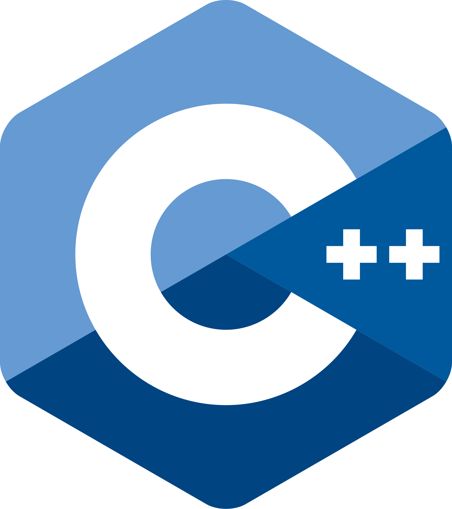

<h1 align="center">nicobrch 🐱</h1>

Software Engineer | AI & Data | Machine Learning | Cloud Certified

<h3 align="center">Contact me</h3>

    

<h3 align="center">Tools 🛠️</h3>

    
    
    
    

